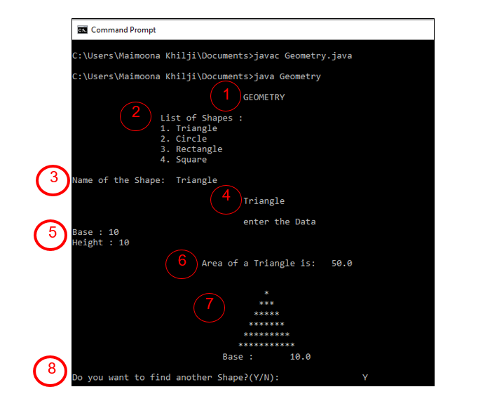
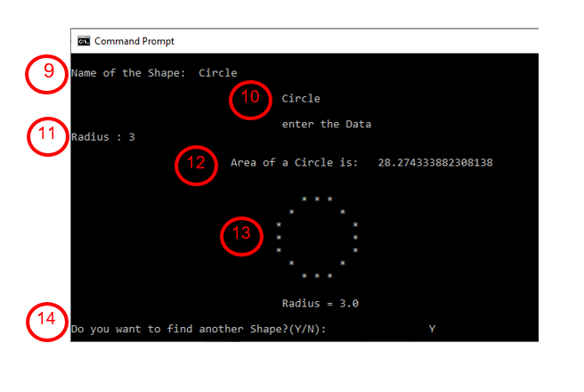
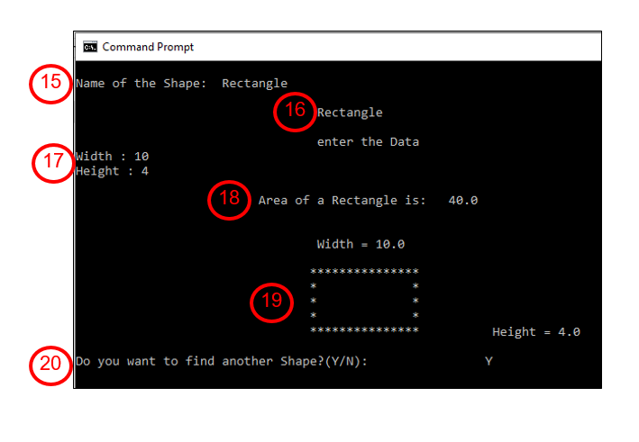
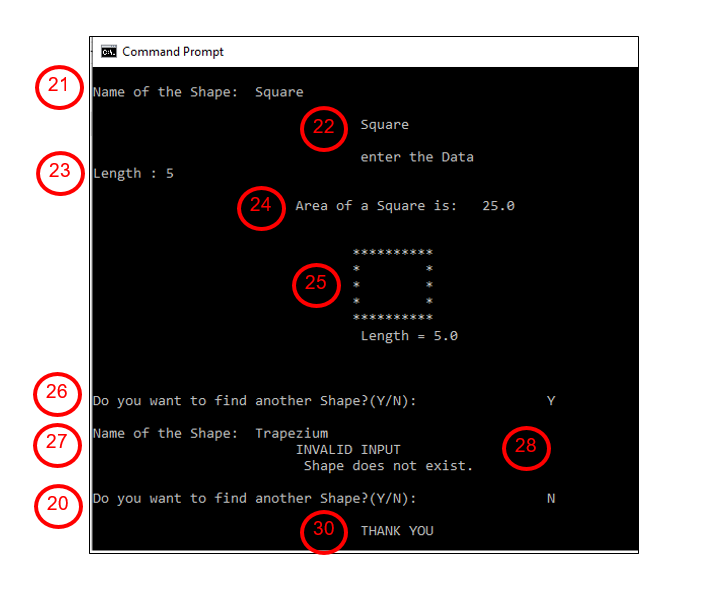

# Geometry-Shapes
A complete java code that draw shapes or geometry and calculate its area using the concept of Polymorphism

This program is based on **Polymorphism** (Static and dynamic polymorphism). This program can calculate the area and display the shape of given geometry. It will take Name of the shape  as an input from user. Then take the inputs of length of sides and calculate the area of the shape. And then print the shape pattern.
<pre>
This program is consists of Four Classes:
•	Default
•	Triangle
•	Circle
•	Rectangle
•	Square
</pre>

**Dynamic Polymorphism**
( Run Time Polymorphism )

<pre>
Overrided Methods:          Void Sides ( )	
Classes:	            Overrided in class Triangle, circle, rectangle, square	
Purpose:                    Here, Lengths of sides are taken as input from users.

Overrided Methods:          Void Area ( )	
Classes:	            Overrided in class Triangle, circle, rectangle, square
Purpose:                    Here, Area of the required shape is calculated.

Overrided Methods:          Void Area ( double area )	
Classes:	            Overrided in class Triangle, circle, rectangle, square
Purpose:                    Here, Area of the shape is printed.

Overrided Methods:          Void Shape ( )	
Classes:	            Overrided in class Triangle, circle, rectangle, square
Purpose:                    Here shape or pattern is printed.

</pre>

**Static Polymorphism**
( Compile Time Polymorphism )

<pre>
Overloaded Methods:          Void Area ( )
Purpose:                     Here, Area of the required shape is calculated.

Overloaded Methods:          Void Area ( double area )
Purpose:                     Here, Area of the shape is printed.
</pre>

**OUTPUT**

<pre>
1.	Print title of Program “Geometry “.
2.	Print list of shapes that is defined in program.
3.	Take the input of name of the shape.
4.	Here it is Triangle.
5.	It will take input of sides i.e. Base and Height.
6.	It will calculate area and then print it.
      •	Formula:  Area of Triangle = ½ (Base * Height )

7.	It will print the shape pattern that is triangle. 
8.	It will ask user that does he want to find another shape or not?
</pre>

<pre>
9.	If Y (YES) , Then it will again ask the name of the shape.
10.	Here it is Circle.
11.	It will take input of radius
12.	It will calculate area and then print it.
	    •	Formula:   Area of Circle = 2 π〖 r〗^2
13. It will print the shape pattern that is Circle.
14. It will ask user again that does he want to find another shape or not?
</pre>

<pre>
15.	If user enters Y (Yes), Then it will again ask the name of the shape.
16.	Here it is Rectangle.
17.	It will take input of width and height.
18.	It will calculate area and then print it.
        •	Formula:  Area of Rectangle = Width * Height 
19.	It will print the shape pattern that is Rectangle.
20.	It will ask user again that does he want to find another shape or not?
</pre>

<pre>
21.	If user enters Y (Yes), Then it will again ask the name of the shape.
22.	Here it is Square.
23.	It will take input of length.
24.	It will calculate area and then print it.
        •	Formula:  Area of Square = Length * Length

25.	It will print the shape pattern that is Square.
26.	It will ask user again that does he want to find another shape or not?
27.	If user entered Y , then it will ask for the name of the shape.
28.	Here Trapezium is entered as the name of the shape.
29.	Trapezium is not defined in this program, so it will print Invalid Input and Shape doesn’t exist.
30.	It will ask again whethere user wants to find any shape or not?. As user enters N ( No ), It will print Thank You  an terminate the program.

</pre>

